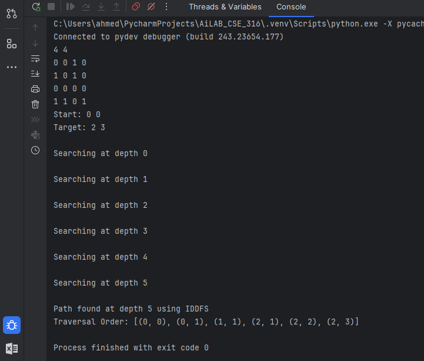
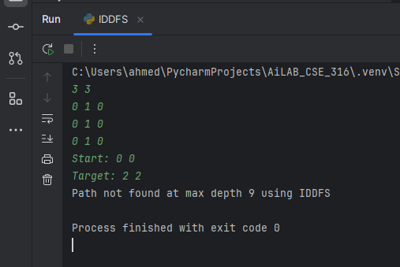

# 🧠 AI Lab CSE 316  


---

## 🔍 Problem: Maze Solving using Iterative Deepening Depth-First Search (IDDFS)  

---

## 📌 Problem Statement

You are given a 2D grid representing a maze, where each cell is either an empty space `0` or a wall `1`. Your task is to implement a Python program that uses **Iterative Deepening Depth-First Search (IDDFS)** to determine whether a valid path exists from a given **start cell** to a specified **target cell**.

The algorithm must:
- Move only in 4 directions: **up**, **down**, **left**, **right**
- Avoid walls and previously visited cells
- Stop once the goal is found or the maximum depth is exceeded

---

## 🛠️ Program Overview

The solution is implemented in an **object-oriented style** with a custom class named `IDDFSMazeSolver`.  

### 🔧 Key Features:
- Accepts **custom maze input** as a 2D grid
- Takes **start** and **goal** positions
- Applies **Iterative Deepening DFS**
- Returns:
  - Whether a path exists or not
  - The **depth** at which the goal was found
  - The **traversal order** (nodes visited during the search)

---

## 💡 How to Run the Program

1. Make sure Python is installed on your system.
2. Save the code in a file named `iddfs_maze_solver.py`
3. Run the script using:
   ```bash
   python iddfs_maze_solver.py

   

## **Example Input and Output**  
### **Input:**  
4 4  
0 0 1 0  
1 0 1 0  
0 0 0 0  
1 1 0 1  
Start: 0 0  
Target: 2 3 


### **Output:**  


### **Input:**  
3 3  
0 1 0  
0 1 0  
0 1 0  
Start: 0 0  
Target: 2 2  
### **Output:**  
