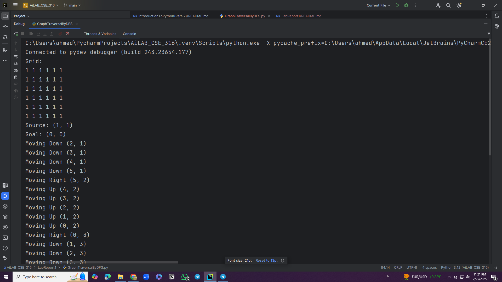
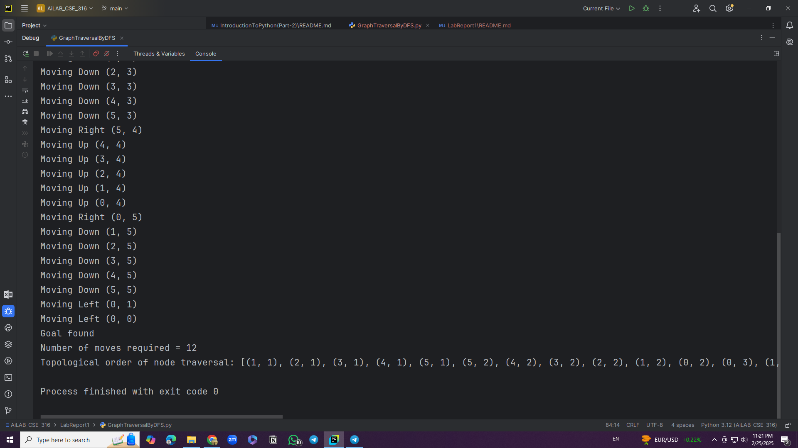

# AI Lab CSE 316  
# Lab Class 02  

---

## **Problem: Random Grid Generation and DFS Pathfinding**  

### **Problem Statement:**  
Write a program that generates a random N×N grid (where N is between 4 and 7) with non-obstacle source and goal states. Perform Depth-First Search (DFS) to find a path from the source to the goal. The program should print the grid, source, goal, DFS path, and the topological order of node traversal.  

---

## **Code Overview**  

The program consists of two classes:  
1. **`Node`**: Represents a node in the grid with coordinates `(x, y)` and depth `z`.  
2. **`DFS`**: Implements the DFS algorithm to traverse the grid and find a path from the source to the goal.  

### **Key Features:**  
- Generates a random N×N grid with `N` between 4 and 7.  
- Randomly places the source and goal on the grid, ensuring they are not the same.  
- Uses DFS to find a path from the source to the goal.  
- Tracks and prints the topological order of node traversal.  
- Prints the grid, source, goal, and the number of moves required to reach the goal.  

---

## **How to Run the Code**  

1. Ensure Python is installed on your system.  
2. Copy the provided code into a Python file (e.g., `dfs_pathfinding.py`).  
3. Run the script using the following command:  
   ```bash
   python GraphTraversalByDFS.py
   
## **Input and Output**  

### **Input:**  
The program generates a random N×N grid and randomly places the source and goal. No external input is required.  

### **Output:**  
The program outputs the following:  
1. The generated grid.  
2. The source and goal coordinates.  
3. The DFS traversal path (directions and coordinates).  
4. Whether the goal is found or not.  
5. The number of moves required to reach the goal (if found).  
6. The topological order of node traversal.  

---

## **Example Input and Output**  

### **Input:**  
No explicit input is required. The program generates the grid and places the source and goal randomly.  

### **Output:**  


